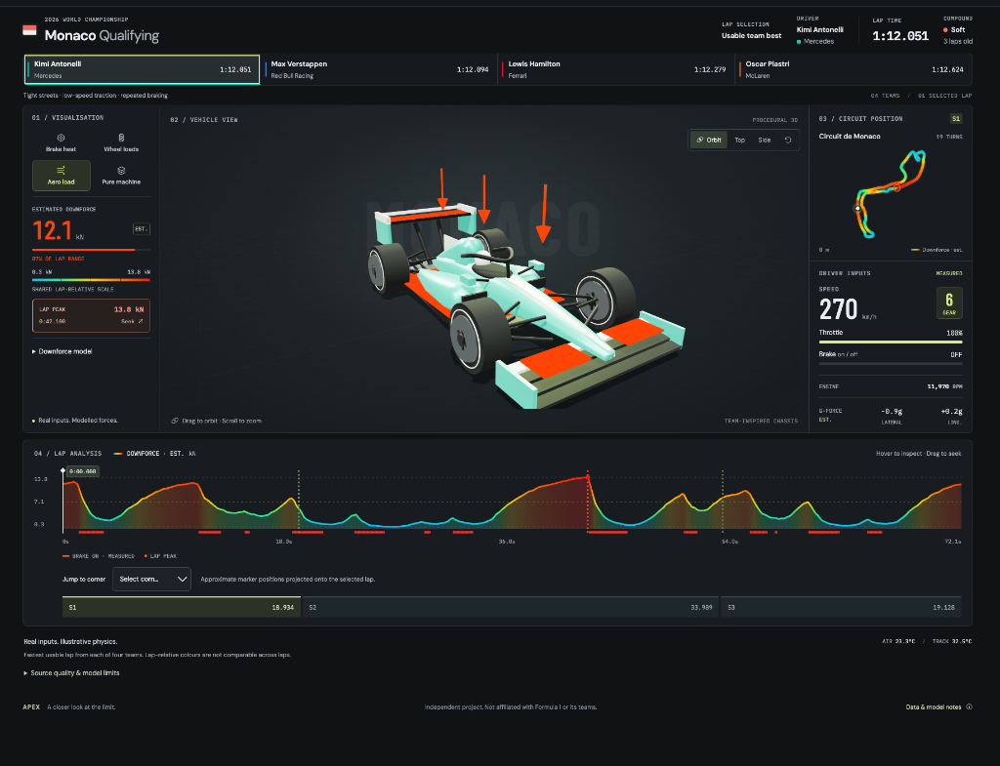
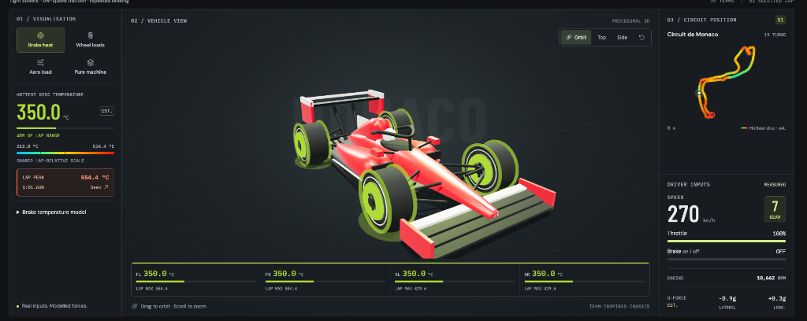

# APEX — F1 Telemetry Lab

**An interactive 3D Formula racing telemetry experience built from real FastF1 qualifying data.**

APEX turns lap telemetry into a professional analysis workspace: orbit a procedural open-wheel car, replay complete laps, inspect driver inputs, and explore animated brake-temperature, wheel-load, and aerodynamic-load estimates across Monaco, Monza, and Suzuka.

> **Real inputs. Transparent estimates.** Speed, throttle, brake state, gear, RPM, position, timing, tyres, and weather come from FastF1. Brake temperature, wheel loads, g-forces, and downforce are explicitly labelled, uncalibrated physics estimates—not measured team telemetry.

## Visual showcase

### Aero-load analysis



### Brake-heat analysis



## Highlights

- **Interactive 3D car** with orbit, top, and side cameras
- **Four visual layers:** brake heat, wheel loads, aero load, and clean bodywork
- **12 real qualifying laps** across three contrasting circuits and four teams per event
- **Team-coloured bodywork** that updates with the selected driver
- **Synchronized analysis:** car, track map, channel trace, inputs, sectors, and transport
- **Precise inspection:** timeline hover readout, lap peaks, sector jumps, and corner seeking
- **Professional data UI:** persistent playback dock, responsive layouts, keyboard controls, and reduced-motion support
- **Defensive data loading:** catalog validation, stale-request protection, explicit failures, and no synthetic fallback
- **Graceful WebGL fallback:** telemetry, map, and playback remain usable without the 3D renderer

## Dataset

The bundled static catalog contains 2026 qualifying telemetry:

| Circuit | Character | Selected drivers |
| --- | --- | --- |
| Monaco | Tight streets, low-speed traction, repeated braking | Kimi Antonelli, Max Verstappen, Lewis Hamilton, Oscar Piastri |
| Monza | Long straights, high speeds, heavy chicane braking | Pierre Gasly, George Russell, Oscar Piastri, Charles Leclerc |
| Suzuka | Flowing esses and sustained high-speed cornering | George Russell, Oscar Piastri, Charles Leclerc, Pierre Gasly |

At each event, official personal-best timing identifies four distinct teams. The exporter then selects each team's fastest usable, accurate, non-pit, non-deleted eligible lap. Source-quality exclusions and substitutions are surfaced in both the catalog and interface.

Suzuka uses **George Russell's 1:29.076** for Mercedes because three faster Antonelli attempts contained unchanged source car-channel stretches of 24.6, 9.7, and 5.1 seconds. No replacement measurements were fabricated.

The runtime reads `public/catalog.json` and the 12 assets under `public/laps/`. `public/lap.json` remains a compatibility copy of the default Monaco lap.

## Measured and estimated channels

| Quantity | Treatment |
| --- | --- |
| Speed, throttle, brake on/off, gear, RPM | FastF1 car channels aligned to playback timestamps |
| XY position | FastF1 position channels, converted from decimetres to metres |
| Lap/sector timing, driver, team, compound, tyre age, weather | FastF1 session metadata |
| Distance | Trapezoidal integration of speed |
| Longitudinal g | Smoothed speed derivative |
| Lateral g | Smoothed path curvature × speed² |
| Wheel loads | Generic quasi-static load-transfer estimate |
| Brake temperature | Residual braking-energy and cooling estimate |
| Downforce | Fixed-coefficient speed-squared estimate |

The app uses a **10 Hz playback grid**; this does not imply that every source channel was natively sampled at 10 Hz. Continuous channels are interpolated from original streams, while brake state, gear, and other discrete values hold their previous sample.

Brake is an on/off flag, not pedal pressure. The legacy DRS field remains in the schema but is not interpreted as active 2026 DRS. The project does not claim tyre temperatures, fuel use, ERS state, suspension telemetry, or measured aero performance.

## Physics model

The same deliberately generic scenario is applied to every driver and circuit:

| Parameter | Assumption |
| --- | ---: |
| Vehicle mass | 800 kg |
| Wheelbase / track width | 3.4 m / 1.6 m |
| Centre-of-gravity height | 0.30 m |
| Static and aero front fraction | 46% |
| Air density | 1.225 kg/m³ |
| Lift coefficient × area | 3.5 m² |
| Drag coefficient × area | 1.2 m² |
| Initial rotor temperature | 350°C |
| Rotor heat capacity | 2,000 J/K per rotor |

### Motion and loads

- Longitudinal acceleration: `a_long = dv/dt`
- Curvature: `κ = (x′y″ − y′x″) / (x′² + y′²)^(3/2)`
- Lateral acceleration: `a_lat = κv²`
- Downforce: `0.5 × airDensity × C_LA × speed²`
- Longitudinal and lateral transfer use the generic mass, geometry, and centre-of-gravity assumptions above
- Nonnegative wheel-load clipping preserves total vertical force

### Brake temperature

For each interval, the model calculates kinetic-energy loss, subtracts assumed aerodynamic drag work, and gates positive residual power using the preceding brake sample. Heating is split 60% front / 40% rear, with 90% assumed rotor absorption.

The stable thermal update is:

```text
T_next = Ta + (T_previous − Ta) exp(−h Δt/C)
       + (P/h)(1 − exp(−h Δt/C))
```

This omits regenerative braking, engine braking, track grade, wind, actual team brake bias, carbon-rotor calibration, radiation, and unknown initial thermal state. Absolute values are illustrative and must not be treated as engineering measurements.

Colours are normalized within the selected lap. **Red means that lap's relative maximum—not a danger threshold—and colours are not numerically comparable between laps.** All four wheels share one scale so front/rear and left/right differences remain visible.

## Data quality

The exporter rejects:

- non-finite or insufficient telemetry;
- uncovered playback intervals;
- native source gaps longer than two seconds; and
- five seconds or more where speed, throttle, brake, gear, and RPM are all exactly unchanged.

Source throttle values outside the physical 0–100% display range are bounded, with the original extrema and adjustment counts retained in quality metadata. Missing corners or weather stay explicit rather than being replaced with synthetic measurements.

The frontend validates asset paths, session identity, lap coverage, timing, ranges, and metadata. Switching selections aborts obsolete requests; failed loads clear previous telemetry instead of displaying it under the wrong driver.

## Technology

- **Vite 6** — static application and production build
- **TypeScript 5** — strict data contracts and application logic
- **Three.js** — procedural car, camera controls, and heat materials
- **Motion** — interruptible discrete UI transitions without a React migration
- **Canvas 2D** — circuit and telemetry trace rendering
- **FastF1 / Python** — extraction, quality checks, and offline estimation
- **Playwright** — browser, responsive, accessibility, failure, and WebGL-fallback coverage

## Run locally

Node.js **22.18+** is recommended. Python is not required to run the bundled application.

```bash
npm install
npm run dev
```

Open the localhost URL printed by Vite, normally `http://127.0.0.1:5173`.

Production build:

```bash
npm run build
npm run preview
```

Vite writes the static application to `dist/`.

## Controls

- Choose a circuit and driver from the header or driver cards.
- Switch between brake heat, wheel loads, aero load, and clean-car views.
- Drag the car to orbit; scroll to zoom; use the camera presets for top and side views.
- Play, pause, seek, skip five seconds, or change playback rate from the persistent dock.
- Hover over the trace to inspect a channel without changing playback time.
- Jump to sector boundaries, approximate corner positions, or the selected layer's true peak sample.
- Press `Space` to play/pause and `←` / `→` to seek one second when focus is outside a control.

## Verification

```bash
npm run build
npm test
.venv-data/bin/python -m unittest test_extract_lap.py
npm run test:e2e
```

The test suites cover telemetry interpolation and validation, heat scaling, model invariants, all catalog assets, driver/circuit switching, request races, failure recovery, playback, seeking, responsive layouts, reduced motion, dialog focus, and operation without WebGL.

To run Playwright with Brave on macOS:

```bash
PLAYWRIGHT_CHROMIUM_EXECUTABLE_PATH="/Applications/Brave Browser.app/Contents/MacOS/Brave Browser" npm run test:e2e
```

## Rebuild the telemetry catalog

Dataset extraction requires Python 3.10+, upstream FastF1 access, and the pinned packages in `requirements.txt`:

```bash
python3 -m venv .venv-data
.venv-data/bin/python -m pip install -r requirements.txt
.venv-data/bin/python extract_lap.py 2026 --catalog
```

Export a standalone fastest-overall or driver-specific lap:

```bash
.venv-data/bin/python extract_lap.py 2026 Monaco public/lap.json
.venv-data/bin/python extract_lap.py 2026 Monaco public/custom-lap.json --driver VER
```

Standalone exports do not alter the selectable catalog. There is no automatic synthetic fallback or silent season substitution.

## Project structure

```text
src/main.ts            Interface, loading, playback, map, and trace
src/car.ts             Procedural 3D car, cameras, paint, and heat layers
src/telemetry.ts       Contracts, validation, interpolation, and heat scales
src/motion.ts          Reduced-motion-aware discrete animation helpers
public/catalog.json    Selectable session and driver catalog
public/laps/           Bundled real lap telemetry
extract_lap.py         FastF1 extraction, quality checks, and estimation
tests/app.spec.ts      End-to-end browser coverage
```

## Limitations and attribution

APEX is an independent educational visualization. It is not affiliated with Formula 1, the FIA, FastF1, or any constructor or driver. Team-inspired colours do not reproduce official liveries, and the procedural car is not a reconstruction of a team's chassis.

Review upstream data terms before redistributing telemetry. Software dependencies and motorsport data have separate licenses and usage conditions. This repository does not grant rights to Formula 1 branding, broadcast assets, or telemetry.

Potential future work includes distance-aligned driver comparison, a cached live FastF1 backend, calibrated reference datasets, and a higher-detail 3D model.